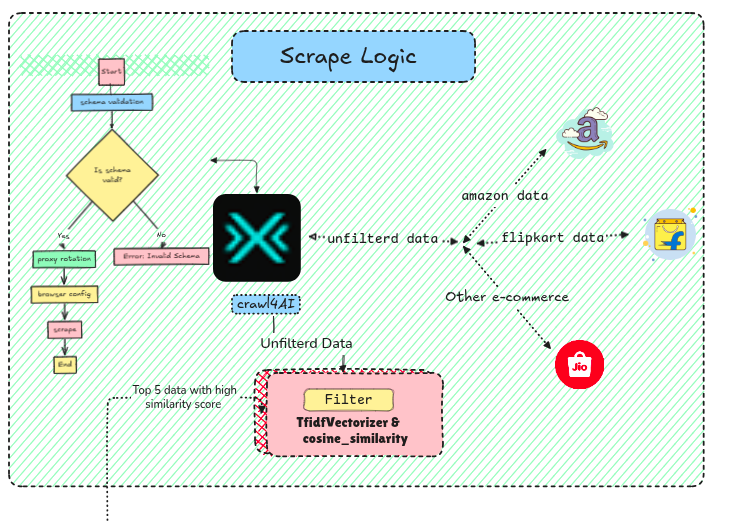

# FindCheap

FindCheap is a web application that helps users find the best prices for products across multiple online retailers.

## Demo Video

[Watch the walkthrough](image/README/FindcheapDemo.mp4) to see the application in action.

## Project Overview

The project consists of two main components:

- **Backend**: Django-based API for data management and web scraping
  
- **Frontend**: React application for the user interface

## Features

- Product price comparison across multiple websites
- Search functionality to find products
- Web scraping with proxy rotation for reliable data collection
- Clean and responsive UI

## Tech Stack

## Database

#### 1. Install postgres and start it .

#### 2. Create Database and User

```
# Switch to the default postgres user
sudo -i -u postgres

# Enter the PostgreSQL shell

psql

# Create a new database

CREATE DATABASE mydb;

# Create a new user

CREATE USER myuser WITH PASSWORD 'mypassword';

# Grant privileges

GRANT ALL PRIVILEGES ON DATABASE mydb TO myuser;

# Grant access to schema

\c mydb
GRANT ALL ON SCHEMA public TO myuser;

# Exit

\q
exit

```

#### 3. Update Django settings.py

```DATABASES = {
    'default': {
        'ENGINE': 'django.db.backends.postgresql',
        'NAME': 'mydb',
        'USER': 'myuser',
        'PASSWORD': 'mypassword',
        'HOST': 'localhost',
        'PORT': '5432',
    }
}
```

### Backend

- Python
- Django
- SQLite
- Web scraping utilities

### Frontend

- React
- Tailwind CSS
- Vite

## Project Structure

```

FindCheap/
├── Backend/ # Django backend
│ ├── api/ # API endpoints
│ ├── backend/ # Django project settings
│ └── scrape_utils/ # Web scraping utilities
│
└── Frontend/ # React frontend
├── public/ # Static assets
└── src/ # React components and logic

```

## Getting Started

### Backend Setup

1. Navigate to the Backend directory:

python -m venv venv

```

cd Backend

```

2. Install dependencies:

```

uv pip install -r requirements.txt

```

3. Run database migrations:

```

python manage.py migrate

```

4. Start the Django server:

```

python manage.py runserver 8000

```

### Frontend Setup

1. Navigate to the Frontend directory:

```

cd Frontend

```

2. Install dependencies:

```

pnpm install

```

3. Start the development server:

```

pnpm dev

```

## Contributing

Contributions are welcome! Please feel free to submit a Pull Request.

## License

This project is licensed under the MIT License.

```

```
